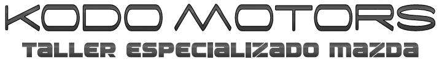

### Prerequisites
- Node.js (v18.x or v20.x)
- npm (v9.x or higher)

### Installation Steps

1. Clonar el repositorio
```bash
git clone https://github.com/NovalyPeru/kodomotors.git
cd kodomotors
```

2. Install dependencies
```bash
npm install
```

3. Si encuentras errores relacionados con Webpack, ejecuta estos comandos:
```bash
npm install @pmmmwh/react-refresh-webpack-plugin@latest
npm install react-scripts@latest
```

4. Iniciar el servidor de desarrollo
```bash
npm start
```

### Troubleshooting

If you encounter any issues during installation:

1. Revisar la version de node:
```bash
node -v
```

2. Limpiar el cache de npm y node_modules(opcional):
```bash
rm -rf node_modules
npm cache clean --force
npm install
```

### Descarga de node 

1. Download and Install NodeJs LTS version from [NodeJs Official Page](https://nodejs.org/en/download/).


